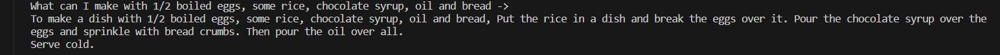
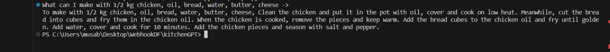

# kitchenGPT-maris-labs
This is utlising OpenAI Davinci model, fine tuned with a dataset to recommend recipes based on user inputted ingredients.

# Future
It will be integrated with a flask server and a React Frontend to have a form, in where user will add the ingredients. This would be sent over to our Flask server which will create a prompt from the data received. 
Then the response will be displayed on the frontend. 

# Console Screenshots of response:

